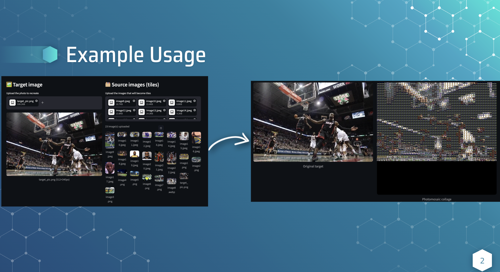

# 🖼️ Image Collage Generator

A photomosaic engine built by the **Michigan Data Science Team (MDST)** at the University of Michigan. This tool recreates any target image using a collection of smaller source photos as tiles — producing a mosaic that reveals the original picture when you zoom out.


[Link to Tool](https://image-collage-generate.streamlit.app/)


---

## How It Works

The pipeline has five main stages:

1. **Image Loading** — Scans a directory of source images and loads them in supported formats (`.jpg`, `.jpeg`, `.png`, `.webp`).

2. **Image Categorization** — Computes the average RGB color for each source image and stores it in a searchable palette. The palette is cached to JSON so it only needs to be built once.

3. **Image Segmentation** — Divides the target image into a configurable grid (e.g., 40×30). Handles remainder pixels by merging them into edge segments.

4. **Color Extraction & Matching** — Extracts the average color of each grid cell and finds the closest source image using one of two distance methods:
   - **Euclidean** — Standard RGB distance.
   - **CIE76 Delta E** — Converts RGB → XYZ → CIELAB color space to measure perceptual distance the way the human eye sees it, producing more natural results.

5. **Rendering the Collage** — Each matched source image is resized to the tile dimensions using Lanczos resampling and pasted into its grid position, producing the final mosaic.

---

## Project Structure

```
Image-Collage-Generation/
├── main.py                  # Main driver — orchestrates the full pipeline
├── config.yaml              # Configuration (paths, grid size, formats)
├── categorize_images.py     # SourceImage & SourceImagePalette classes, caching
├── segment_target.py        # Grid segmentation & average color extraction
├── color_matching.py        # Euclidean & Delta E color matching algorithms
├── color_analysis.py        # Color analysis utilities
├── extract_target_colors.py # Extract colors from target image sections
├── render_collage.py        # Assembles the final collage image
├── requirements.txt         # Python dependencies
├── data/
│   ├── source_images/       # Place your source tile images here
│   └── target_images/       # Place your target image(s) here
├── cache/                   # Cached palette data (auto-generated)
├── output/                  # Output collages (auto-generated)
├── src/                     # Package source modules
└── utils/                   # Utility functions (image loading, color analysis)
```

---

## Getting Started

### Prerequisites

- **Python 3.13+**

### Installation

1. **Clone the repository:**
   ```bash
   git clone https://github.com/jobdhill/Image-Collage-Generation.git
   cd Image-Collage-Generation
   ```

2. **Create and activate a virtual environment:**
   ```bash
   # macOS/Linux
   python3.13 -m venv venv
   source venv/bin/activate

   # Windows
   py -3.13 -m venv venv
   ./venv/Scripts/activate
   ```

3. **Install dependencies:**
   ```bash
   pip install -r requirements.txt
   ```

### Usage

1. **Add source images** to `data/source_images/` — these are the small photos that will make up the mosaic tiles. The more variety you have, the better the result.

2. **Add a target image** to `data/target_images/` — this is the image you want to recreate as a collage.

3. **Configure settings** in `config.yaml` (optional):
   ```yaml
   collage:
     grid_segments_x: 40   # Number of columns
     grid_segments_y: 30   # Number of rows
   ```

4. **Run the generator:**
   ```bash
   python main.py
   ```

5. Your collage will be saved to `output/collages/`.

---

## Configuration

All settings are managed in `config.yaml`:

| Setting | Description | Default |
|---|---|---|
| `source_images.directory` | Path to source image folder | `data/source_images` |
| `source_images.supported_formats` | Accepted file types | `.jpg, .jpeg, .png, .webp` |
| `source_images.cache_file` | Path for cached palette | `cache/source_images.json` |
| `target_images.directory` | Path to target image folder | `data/target_images` |
| `collage.grid_segments_x` | Number of horizontal segments | `40` |
| `collage.grid_segments_y` | Number of vertical segments | `30` |
| `collage.output_directory` | Path for output collages | `output/collages` |

---

## Color Matching Methods

### Euclidean (RGB)
Standard straight-line distance between two colors in RGB space. Fast but can produce less visually accurate matches because RGB doesn't map linearly to human perception.

### CIE76 Delta E (CIELAB)
Converts colors through RGB → XYZ → CIELAB and computes perceptual distance. More computationally expensive but produces noticeably better results because it accounts for how the human eye actually perceives color differences.

---

## Dependencies

- **Pillow** (≥10.0.0) — Image loading, cropping, resizing, and rendering
- **NumPy** (≥1.24.0) — Vectorized color computation and distance calculations
- **tqdm** (≥4.65.0) — Progress bars
- **PyYAML** (≥6.0) — Configuration file parsing

---

## Built With

This project was built as part of the **Michigan Data Science Team (MDST)** at the University of Michigan and showcased at **Data Science Night**.

---

## License

This project is open source. See the repository for details.
